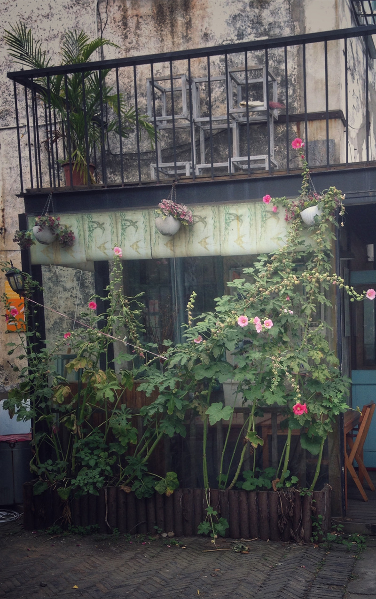

讲 Bootstrap 基础的教程网上已经很多了，实际上 Bootstrap 中文网（bootcss.com）里的文档已经写的很详细了，但实战的案例却不多。这里用一些当前流行的网页布局为导向，使用 Bootstrap 中的样式来完成它。每次只讲与案例相关的知识点，边学边练，加强理解。练习本案例需有 HTML/CSS 基础。

## 一、案例介绍

瀑布流是近几年流行起来的一种网页布局，视觉表现为参差不齐的多栏布局，本案例便是使用 Bootstrap 实现一个瀑布流布局。


## 二、相关的 Bootstrap 知识点

### 2.1 配置 Bootstrap

#### 2.1.1 首先去 Bootstrap 官网（[bootcss.com](https://v3.bootcss.com/getting-started/#download)）下载“用于生产环境的Bootstrap”。

#### 2.1.2 在 `<head>` 标签内引入 CSS 文件夹内的经过压缩的 `bootstrap.min.css`。

#### 2.1.3 因为 Bootstrap 的 JS 插件是依赖 jQuery 的，所以想用他的 JS 插件必须先引入 jQuery ，然后再引入 JS 文件夹下的 `bootstrap.min.js`。

```
<!--BootstrapCSS文件，放在<head>内-->
<link type="text/css" href="https://cdn.bootcss.com/bootstrap/3.3.7/css/bootstrap.min.css" rel="stylesheet">
<!--jQuery文件，引入BootstrapJS插件前必需引入-->
<script language="javascript" type="text/javascript" src="http://libs.baidu.com/jquery/1.9.1/jquery.min.js"></script>
<!--BootstrapJS文件，一般放在底部-->
<script language="javascript" type="text/javascript" src="https://cdn.bootcss.com/bootstrap/3.3.7/js/bootstrap.min.js"></script>
<!--让IE使用最新的渲染模式，支持CSS3-->
<meta http-equiv="X-UA-Compatible" content="IE-edge,chrome=1">
<!--如果IE版本低于IE9，使浏览器支持HTML5和CSS3-->
<!--[if lt IE 9]>
<script src="http://cdn.bootcss.com/html5shiv/3.7.3/html5shiv.min.js"></script>
<script src="http://cdn.bootcss.com/respond.js/1.4.2/respond.min.js"></script>
<![endif]-->
```

### 2.2 栅格系统

> 官方解释：Bootstrap 提供了一套响应式、移动设备优先的流式栅格系统，随着屏幕或视口（viewport）尺寸的增加，系统会自动分为最多 12 列。它包含了易于使用的预定义类。

简单来说，就是 Bootstrap 为了快速布局从外到内写好了三类样式：

* 外层的固定宽度 `.container` 或 100% 宽度 `.container-fluid` 样式；
* 行 `.row` 样式，必须包含在 `.container` 或 `.container-fluid` 中；
* 列 `.col-md-*`（`*` 可以是 1 到 12，此处代表中等屏幕按此标准显示，`.col-md-1` 占 `.row` 的 1/12，`.col-md-12` 占 `.row` 的 12/12）或列偏移 `.col-md-offset-*`（`*` 可以是 1 到 12），包含在 `.row` 容器中，从而快速进行栅格布局。

`.col-md-*` 示例：

```
<!--代码部分-->
<div class="container-fluid">
    <div class="row">
        <div class="col-md-1">1/12</div>
        <div class="col-md-1">1/12</div>
        <div class="col-md-1">1/12</div>
        <div class="col-md-1">1/12</div>
        <div class="col-md-1">1/12</div>
        <div class="col-md-1">1/12</div>
        <div class="col-md-1">1/12</div>
        <div class="col-md-1">1/12</div>
        <div class="col-md-1">1/12</div>
        <div class="col-md-1">1/12</div>
        <div class="col-md-1">1/12</div>
        <div class="col-md-1">1/12</div>
    </div>
    <div class="row">
        <div class="col-md-1">1/12</div>
        <div class="col-md-3">3/12</div>
        <div class="col-md-4">4/12</div>
        <div class="col-md-4">4/12</div>
    </div>
    <div class="row">
        <div class="col-md-6">6/12</div>
        <div class="col-md-6">6/12</div>
    </div>
</div>
```

`.col-md-*` 效果图：


使用列偏移 `.col-md-offset-*` 示例：

```
<!--代码部分-->
<div class="container-fluid">
    <div class="row">
        <div class="col-md-1">1/12</div>
        <div class="col-md-1">1/12</div>
        <!--这里向右偏移4/12-->
        <div class="col-md-1 col-md-offset-4">1/12</div>
        <div class="col-md-1">1/12</div>
        <div class="col-md-1">1/12</div>
        <div class="col-md-1">1/12</div>
        <div class="col-md-1">1/12</div>
        <div class="col-md-1">1/12</div>
    </div>
    <div class="row">
        <div class="col-md-3 col-md-offset-1">3/12</div>
        <div class="col-md-4 col-md-offset-4">4/12</div>
    </div>
    <div class="row">
        <div class="col-md-4  col-md-offset-4">6/12</div>
    </div>
</div>
```

`.col-md-offset-*` 效果图：


另外需要注意的是，不管 `.col-md-*` 和 `.col-md-offset-*` 怎么搭配使用都要保证 `*` 总和不超过 12，不然会发生断行现象。

### 2.3 缩略图

缩略图最常出现的是在产品的展示页，最常见的比如一些购物网站的商品展示。

缩略图需要配合上面所介绍的栅格系统来使用，使用方法是把 `` 标签包在带 `.thumbnail` 样式的容器里面，如果我们想添加一段文字描述，可以在里面添加一个样式为 `.caption` 的容器。

`.thumbnail` 示例：

```
<!--代码部分-->
<div class="container-fluid">
    <div class="row">
        <div class="col-md-4">
            <div class="thumbnail">
                
                <div class="caption">
                    <h4>标题 - 缩略图</h4>
                    <small>我是缩略图里面的描述，我是缩略图里面的描述，我是缩略图里面的描述，我是缩略图里面的描述，我是缩略图里面的描述。</small>
                </div>
            </div>
        </div>
        <div class="col-md-4">
            <div class="thumbnail">
                
                <div class="caption">
                    <h4>标题 - 缩略图</h4>
                    <small>我是缩略图里面的描述，我是缩略图里面的描述，我是缩略图里面的描述，我是缩略图里面的描述，我是缩略图里面的描述。</small>
                </div>
            </div>
        </div>
        <div class="col-md-4">
            <div class="thumbnail">
                
                <div class="caption">
                    <h4>标题 - 缩略图</h4>
                    <small>我是缩略图里面的描述，我是缩略图里面的描述，我是缩略图里面的描述，我是缩略图里面的描述，我是缩略图里面的描述。</small>
                </div>
            </div>
        </div>
    </div>
</div>
```

`.thumbnail` 效果图：


### 2.4 响应式图片

为了让图片适应容器的大小，可以为图片添加 `.img-responsive` 样式。

`.img-responsive` 示例：

```

```

另外还可以添加 `img-rounded`/`img-circle`/`img-thumbnail` 让图片呈现圆角/圆形/缩略图的形状。

改变图片形状示例：

```
<!--代码部分-->
<div class="container-fluid">
    <div class="row">
        <div class="col-md-4">
            
        </div>
        <div class="col-md-4">
            
        </div>
        <div class="col-md-4">
            
        </div>
    </div>
</div>
```

改变图片形状效果图：


## 三、瀑布流布局实战

### 3.1 排列图片

看完了上面的内容，下面就开始实战了。首先用栅格结构搭建一个放图片的区域，这里我们在左右各留 1/12 的空白。

```
<!--代码部分-->
<section class="container-fluid">
    <div class="row">
        <div class="col-md-10 col-md-offset-1">
        <!--这里放图片-->
        </div>
    </div>
</section>
```

效果图：


然后用上面所看到的带描述的缩略图样式，每个缩略图又占这中间 10/12（看作一个整体）的 4/12，每行放三个缩略图，放三行。缩略图里的图片用响应式图片的样式 `.img-responsive` 和圆角样式 `.img-rounded` 修饰下。

```
<!--代码部分-->
<section class="container-fluid">
    <div class="row">
        <div class="col-md-10 col-md-offset-1">
            <!--图片开始-->
            <div class="col-md-4">
                <div class="thumbnail">
                    <a href="javascript:void(0);">
                        
                    </a>
                    <div class="caption">
                        <h4>标题 - 实战</h4>
                        <p>
                            <small>阅读是运用语言文字来获取信息，认识世界，发展思维，并获得审美体验的活动。它是从视觉材料中获取信息的过程。视觉材料主要是文字和图片，也包括符号、公式、图表等。</small>
                        </p>
                    </div> 
                </div>
            </div>
            <div class="col-md-4">
                <div class="thumbnail">
                    <a href="javascript:void(0);">
                        
                    </a>
                    <div class="caption">
                        <h4>标题 - 实战</h4>
                        <p>
                            <small>阅读是运用语言文字来获取信息，认识世界，发展思维，并获得审美体验的活动。它是从视觉材料中获取信息的过程。视觉材料主要是文字和图片，也包括符号、公式、图表等。</small>
                        </p>
                    </div> 
                </div>
            </div>
            <div class="col-md-4">
                <div class="thumbnail">
                    <a href="javascript:void(0);">
                        
                    </a>
                    <div class="caption">
                        <h4>标题 - 实战</h4>
                        <p>
                            <small>阅读是运用语言文字来获取信息，认识世界，发展思维，并获得审美体验的活动。它是从视觉材料中获取信息的过程。视觉材料主要是文字和图片，也包括符号、公式、图表等。</small>
                        </p>
                    </div> 
                </div>
            </div>
            <!--第四到第九个缩略图-->
            ...
            ...
            ...
            ...
            ...
            ...
            <!--图片结束-->
        </div>
    </div>
</section>
```

效果图：


### 3.2 实现瀑布流

到这里已经把图片排列好了，但是看起来怪怪的，因为上下图片之间有一片空隙，看起来很不美观，我们的瀑布流的特点是宽度一致，高度自适应布局。目前已经实现了宽度一致，要想实现高度自适应要用到 CSS3 中的一个样式 `column-width`。

> 官方解释：设置或检索对象每列的宽度，对应的脚本特性为 columnWidth。

给容器加了 `column-width` 这个样式时，浏览器会给你计算容器里面的 `<div>` 应该显示多少列，计算一个相对合理的布局方式。

首先我们给缩略图外部的容器加一个 `id="container"`。

```
<!--代码部分-->
<div class="row">
    <div class="col-md-10 col-md-offset-1" id="container">
        <!--图片开始-->
        <div class="col-md-4">
            <div class="thumbnail">
```

然后为这个 `id` 加上 `column-width` 样式。

```
<!--代码部分-->
#container{
    -webkit-column-width:354px; /*Safari and Chrome*/
    -moz-column-width:354px; /*Firefox*/
    -o-column-width:354px; /*Opera*/
    -ms-column-width:354px; /*IE*/
    column-width:354px;
}
#container>div{
    width:354px; /*宽度根据实际情况调节，应与上面一致*/
    overflow:auto; /*防止内容溢出导致布局错位*/
}
```

效果图：


因为现在主流浏览器（Chrome/Firefox/Opera/Safari）都已经支持了 CSS 变量，为了方便调试和维护，上面的 CSS 代码也可以这么写。

```
<!--代码部分-->
body{
    body{
    font-family:"微软雅黑";
    --img-width:354px; /*两根连词线"--"加变量名"img-width"声明变量*/
}
#container{
    -webkit-column-width:var(--img-width); /*用"var(--变量名)"使用变量*/
    -moz-column-width:var(--img-width);
    -o-column-width:var(--img-width);
    -ms-column-width:var(--img-width);
    column-width:var(--img-width);
}
/*另：var()里面可以放第二个参数，在变量不存在时取第二个值，例如var(--img-width,200px)中，如果"--img-width"不存在则使用第二个参数"200px"*/
#container>div{
    width:var(--img-width);
    overflow:auto;
}
```

到这里我们的 Bootstrap 瀑布流布局就完成了，一步步完成下来还是很简单的，演示地址：[https://mazey.cn/bootstrap-blueprints/lesson-first-waterfall/index.html](https://mazey.cn/bootstrap-blueprints/lesson-first-waterfall/index.html)，源码地址：[https://github.com/mazeyqian/bootstrap-blueprints/tree/master/lesson-first-waterfall](https://github.com/mazeyqian/bootstrap-blueprints/tree/master/lesson-first-waterfall)。

### 3.3 扩展

除了用 CSS3 实现瀑布流之外，还可以用 JavaScript 来实现这个效果，参考代码如下。

```
//页面加载完之后再加载瀑布流
window.onload = function(){
    //这里引用col-md-4是因为在盒子里包裹图片没有其他作用，如果不想冲突也可以创建其他Class
    loadWaterfall('container','col-md-4');
}

//加载瀑布流函数//思路来自Amy老师
function loadWaterfall(boxID,thumbnailClass){
    //获取装缩略图外部的盒子
    var box = document.getElementById(boxID);
    //获取装缩略图的数组
    var thumbnail = box.getElementsByClassName(thumbnailClass);
    //获取每个缩略图的宽度
    var thumbnailWidth = thumbnail[0].offsetWidth;
    //计算盒子内每行可以排列几个缩略图
    var colCount = Math.floor((document.documentElement.clientWidth*(10/12))/thumbnailWidth);
    //创建放每次整理好的高度数组
    var thumbnailHeightArr = [];
    for(var i = 0; i < thumbnail.length; i++){
        //获取第一行高度数组
        if(i < colCount){
            thumbnailHeightArr.push(thumbnail[i].offsetHeight);
        }else{
            //获取之前最小高度
            var minHeight = Math.min.apply(null,thumbnailHeightArr);
            //第一行最小高度索引
            var minIndex = thumbnailHeightArr.indexOf(minHeight);
            //将此缩略图放在上面那行最小高度下面
            thumbnail[i].style.position = 'absolute';
            //距离顶部长度为这个缩略图上面那个缩略图的长度
            thumbnail[i].style.top = minHeight + 'px';
            //距离左边长度为这个缩略图上面那个缩略图距离左边的长度
            thumbnail[i].style.left = thumbnail[minIndex].offsetLeft + 'px';
            //更新最小高度
            thumbnailHeightArr[minIndex] += thumbnail[i].offsetHeight;
        }
    }
}
```

用 JavaScript 实现瀑布流最明显的一个好处就是对于 IE 的兼容性更好一些，因为 Windows7 捆绑安装 IE 浏览器的缘故，国内使用 IE 的群体非常庞大，这使得我们在制作网页时不得不考虑 IE 浏览器的兼容问题。

JavaScript 实现瀑布流参考源码地址：[https://github.com/mazeyqian/bootstrap-blueprints/tree/master/lesson-first-waterfall-javascript](https://github.com/mazeyqian/bootstrap-blueprints/tree/master/lesson-first-waterfall-javascript)。

## 四、总结

本文介绍了 Bootstrap 的基本配置、栅格系统、缩略图、响应式图片和部分 CSS3 样式，其中**栅格系统**因为可以实现响应式布局尤其重要。

**版权声明**

本博客所有的原创文章，作者皆保留版权。转载必须包含本声明，保持本文完整，并以超链接形式注明作者[后除](https://blog.mazey.net/author/mazey)和本文原始地址：[https://blog.mazey.net/2399.html](https://blog.mazey.net/2399.html)

（完）